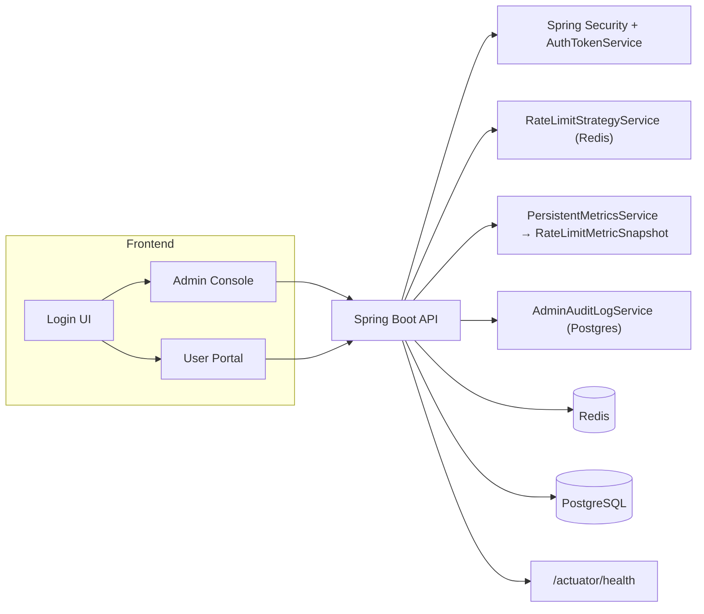
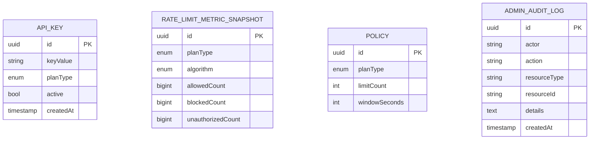
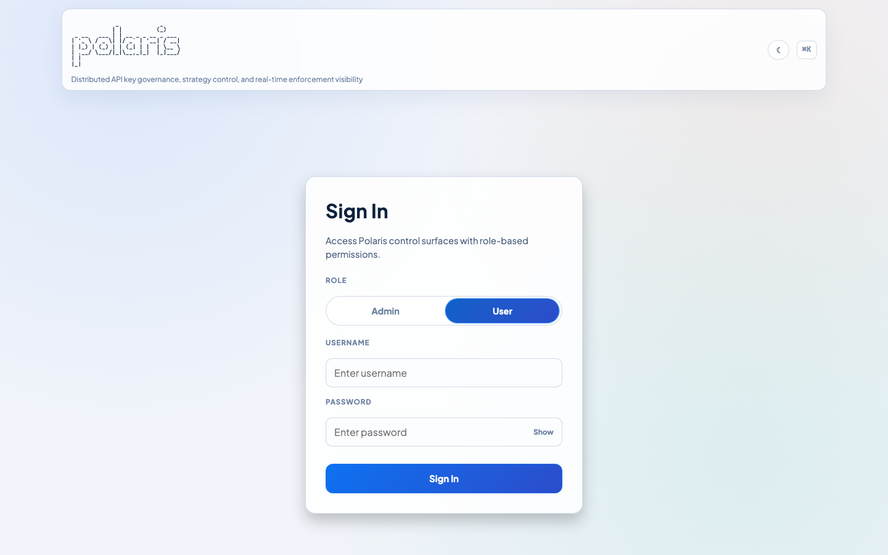
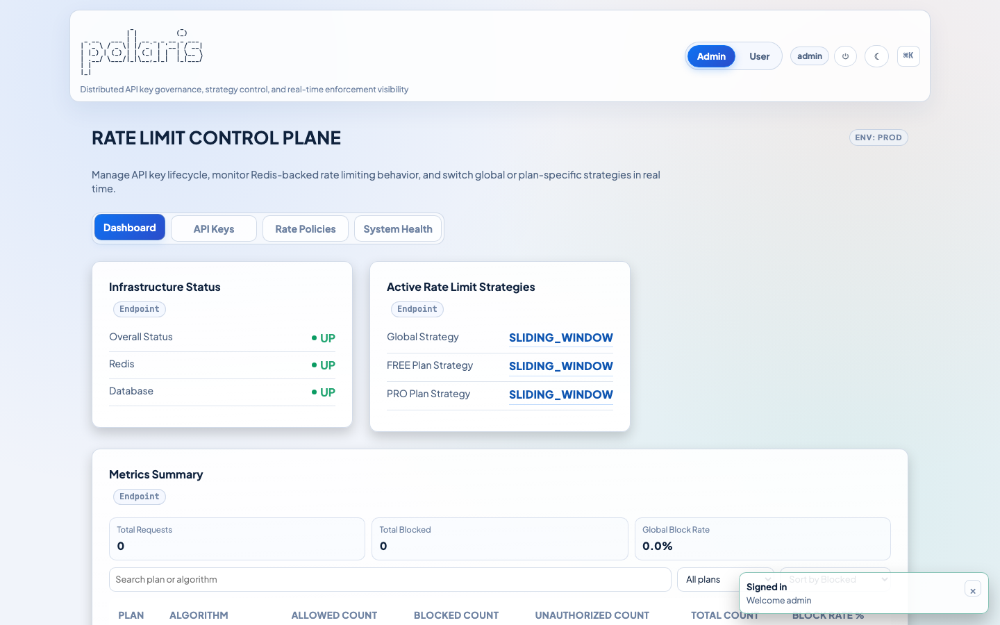
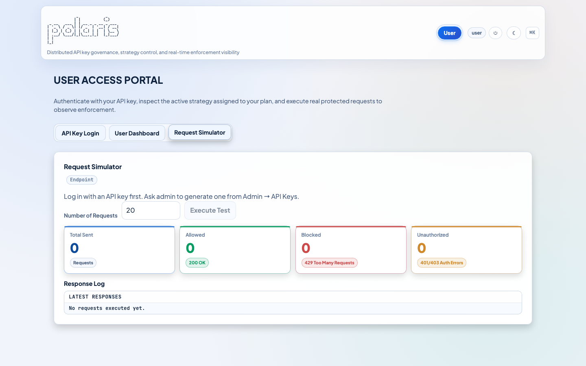

[](https://adoptium.net/)
[](https://spring.io/projects/spring-boot)
[](https://vite.dev/)
[](#security-rbac)

# Polaris Rate Control Plane

> Production-inspired internal control plane for rate-limited APIs, mirroring backend RBAC, strategy control, persistent metrics, and observability in a polished admin/user console.

## Why it exists

Many demos stop at “backend works”. Polaris combines hardened backend primitives—strategy toggles, persistent block/allow/unauthorized metrics, API key lifecycle, audited actions, and RBAC—with a premium UI so backend engineers can demonstrate operational control without sacrificing fidelity.

## Highlights

1. **Backend reality, frontend fidelity** – React + Vite UI calls the exact Spring Boot endpoints the backend ships: auth/strategy/metrics/keys/audit routes. No mock data on the UI until you wire the backend; the UI simply surfaces what the API returns.
2. **Enterprise metrics** – `PersistentMetricsService` seeds and keeps block/allow/unauthorized counts per plan+algorithm. The admin page shows totals, block-rate %, and derived global summaries that refresh every 10 seconds so operators see the latest state.
3. **API key lifecycle** – Admins generate keys per plan, copy key + UUID, sort/filter the table, deactivate keys, and each operation logs via `AdminAuditLogService`. Users reuse those keys in the user portal to test the exact rate-limit behavior.
4. **Strategy guardrails** – Redis-backed `RateLimitStrategyService` stores a global default plus overrides per plan. The UI mirrors the configuration, highlights the active strategy, and logs every shift for traceability.
5. **Simulated enforcement** – The user portal’s request simulator replays `/api/protected/test` hits, tallying 200/429/401 responses so you can prove how the enforcement surface behaves for the selected key.

## UI surface

| Section | Description |
|---|---|
| Role-aware Login | Segmented Admin/User toggle, ASCII `POLARIS` header, inline errors, show/hide password, explicit role enforcement. The backend rejects a login if the selected role is not part of the account’s authorities. |
| Admin Dashboard | Four-column metrics grid (Total Sent / Allowed / Blocked / Unauthorized) with accent badges, hover elevation, consistent spacing, plus infrastructure status, global strategy, detailed metrics table, and block-rate percentage gradient classes. |
| API Keys | Create-by-plan fieldset, copy key/UUID actions, lookup form, paginated table with plan/status sorting, and quick deactivate button. |
| Rate Policies | Global strategy card plus FREE/PRO override blocks; plan badges and soft borders echo the emphasis on strategy importance. |
| System Health | `/actuator/health` status, raw JSON dump, and audit log feed with refresh control, perfect for observability reviews. |
| User Portal | API key login, user dashboard showing current strategy + metadata, and a request simulator with metric cards + response log to stress-test rate limit enforcement. |

## Architecture



## Data model (highlights)



## Security / RBAC

- Login endpoint requires `{ username, password, role }`; the backend verifies the selected role is granted before issuing a token.
- Tokens live in `AuthTokenService`’s `ConcurrentHashMap` with a 12-hour TTL (`polaris.auth.token-ttl-seconds`). Logout revokes the token.
- Spring Security guards:
  - `/actuator/health`, `/actuator/health/**`, `/actuator/info` → public (for Render health checks)
  - `/admin/**`, `/api/keys/**`, `/profiles/admin`, `/actuator/**` → `ROLE_ADMIN`
  - `/profiles/user`, `/api/protected/**` → `ROLE_USER | ROLE_ADMIN`

## Observability + logging

- Structured logging via SLF4J with event keys surfaces API key creations, deactivations, and strategy swaps.
- System Health tab shows `/actuator/health` status + raw JSON while audit logs provide a timeline of admin actions.

## Screenshots

| Flow | Screenshot |
|---|---|
| Login card |  |
| Admin dashboard (metrics + strategy) |  |
| API Keys table |  |
| Rate policies + overrides |  |
| System Health + audit logs |  |
| User simulator + response log |  |

Replace these placeholders with real captures; the helper below regenerates them whenever you refresh branding or layout.

### Regenerating screenshots

1. Build the frontend: `cd frontend && npm run build`.
2. Install Playwright + Chromium (only once per machine): `npm install playwright` and `npx playwright install chromium`.
3. Run `node scripts/capture-screenshots.js` to write six PNGs under `docs/screenshots/`.

## Getting started (anyone can clone + run)

```bash
git clone https://github.com/kailas2004/polaris.git
cd polaris
docker compose up -d postgres redis
./mvnw spring-boot:run
cd frontend
npm install
npm run dev -- --host 0.0.0.0 --port 5173
```

Visit `http://localhost:5173` and log in as:
- Admin: `admin` / `Admin@123`
- User: `user` / `User@123`

API keys are created from Admin → API Keys and then pasted into the user portal for simulator runs.

## Free cloud deployment

For a zero-cost deployment on Render (backend + Postgres + Redis + frontend), follow:

- [Render free deployment guide](docs/DEPLOY_RENDER_FREE.md)

### Live URLs

- Frontend: `https://polaris-frontend-k8ki.onrender.com`
- Backend API base: `https://polaris-api-m242.onrender.com`
- Backend health: `https://polaris-api-m242.onrender.com/actuator/health`

## API summary

- `POST /auth/login` – `{ username, password, role }` → token + roles.
- `POST /auth/logout` – revokes bearer token.
- `GET /auth/me` – current user info.
- `GET /profiles/admin` – global + plan-specific strategy view.
- `GET /profiles/user` – requires `X-API-KEY`, returns plan info + current strategy.
- `POST /api/keys?plan=FREE|PRO` – create key (admin).
- `GET /api/keys` – list keys (admin).
- `DELETE /api/keys/{id}` – deactivate key (admin).
- `GET /admin/metrics/summary` – persisted metrics rows (admin).
- `GET /admin/audit/logs?limit={n}` – recent admin actions (admin).
- `GET /admin/strategy` – global strategy (admin).
- `POST /admin/strategy?strategy=SLIDING_WINDOW|TOKEN_BUCKET[&plan=FREE|PRO]` – update strategy.
- `GET /actuator/health` – infrastructure status.
- `GET /api/protected/test` – rate-limited endpoint consumed by the simulator.

## Environment variables

| Variable | Purpose |
|---|---|
| `SPRING_DATASOURCE_URL` | PostgreSQL JDBC URL (default `jdbc:postgresql://localhost:5434/polaris`). |
| `SPRING_DATASOURCE_USERNAME` | DB user |
| `SPRING_DATASOURCE_PASSWORD` | DB password |
| `SPRING_DATA_REDIS_HOST` | Redis host |
| `SPRING_DATA_REDIS_PORT` | Redis port |
| `polaris.auth.admin.username`/`password` | Admin credentials |
| `polaris.auth.user.username`/`password` | User credentials |
| `polaris.auth.token-ttl-seconds` | Session length (default `43200`). |
| `polaris.cors.allowed-origins` | CORS origins (e.g., `http://localhost:5173`). |
| `PORT` | Backend port (default `8080`). |

## Testing + quality

- Backend: `./mvnw test`
- Coverage report: `./mvnw verify` → `target/site/jacoco/index.html`
- Frontend: `cd frontend && npm run build`
- (Optional) Playwright validation: `BASE_URL=http://localhost:8080 node scripts/playwright-validate.mjs`

## References

- Frontend entry: `frontend/src/main.jsx` (React + Vite)
- Backend entry: `src/main/java/com/kailas/polaris/PolarisApplication.java`
- Screenshot helper: `scripts/capture-screenshots.js`
- Docker compose orchestrates Postgres + Redis (`docker-compose.yml`).
