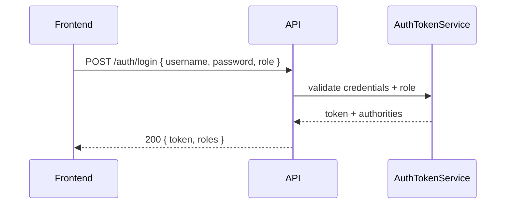
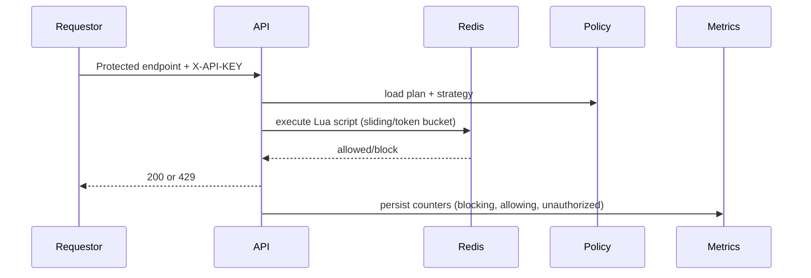
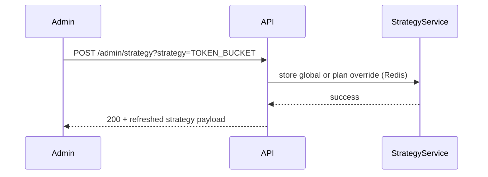
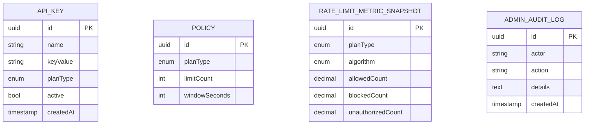

[](https://adoptium.net/)
[](https://spring.io/projects/spring-boot)
[](https://vite.dev/)
[](#roles-and-access)

# Polaris Rate Control Plane

> Production-inspired control plane for enforcing RBAC-aware rate limits, audited API keys, and transparent observability across frontend and backend.

## Why it exists

Rate limiting demos often stop after one request triggers a `429`. Polaris models the full operational surface: strategy rollouts, Redis-backed state, persistent metrics, audited key lifecycles, and a premium console so backend engineers can prove how enforcement and RBAC behave in a real delivery environment.

## Quick navigation

- [Live Demo](#live-demo)
- [UI preview](#ui-preview)
- [Engineering invariants](#engineering-invariants)
- [State model](#state-model)
- [System architecture](#system-architecture)
- [Core execution flows](#core-execution-flows)
- [Data model](#data-model)
- [Design decisions](#design-decisions-and-rationale)
- [Failure modes](#failure-modes-and-handling)
- [Telemetry](#telemetry-and-logging)
- [Roles and access](#roles-and-access)
- [API summary](#api-summary)
- [Local development](#local-development)
- [Environment variables](#environment-variables)
- [Testing](#testing)
- [Deployment (Railway)](#deployment-railway)

## Live demo

- **Frontend:** https://polaris-frontend-production.up.railway.app  
- **Backend health:** https://polaris-api-production-96ea.up.railway.app/actuator/health  
- **Credentials**
  - Admin: `admin` / `Admin@123`
  - User: `user` / `User@123`

Admin accounts are intentionally private; the demo user is read-only so you can exercise the simulator, dashboards, and strategy cards without modifying policies.

## UI preview

| Flow | Screenshot |
|---|---|
| Login |  |
| Admin dashboard (metrics + strategy) |  |
| API keys table |  |
| Rate policies + overrides |  |
| System health + audit log feed |  |
| User simulator + response log |  |

## Engineering invariants

- **Deterministic enforcement** – Redis-backed strategies, Lua rate limiters, and plan-aware algorithms consistently return the same HTTP outcome for a given API key state.
- **Audited key lifecycle** – `ApiKeyService` records create/deactivate events, stores UUIDs, and surfaces actions in `AdminAuditLogService`.
- **RBAC as guardrail** – Spring Security enforces `ROLE_ADMIN` vs. `ROLE_USER` on every endpoint regardless of frontend controls.
- **Observable health** – `/actuator/health`, metrics endpoints, and dashboards surface DB + Redis + strategy status plus persistent metrics seeded by `PersistentMetricsService`.
- **Frontend/backbone parity** – React UI calls the exact backend routes; no fake data, just live responses from Spring Boot.

## State model

### Allowed API key statuses

| Status | Meaning |
|---|---|
| `ACTIVE` | Key can be used by users; rate limits counted. |
| `INACTIVE` | Key is disabled, stored for auditing. |
| `EXPIRED` | Key flagged by admin and cannot be reused. |

Unauthorized transitions are rejected; `ApiKeyController` returns `400` with a clear message if a request tries to activate a deleted key or vice versa.

## System architecture

```mermaid
flowchart LR
    Frontend[React + Vite UI] --> API[Spring Boot API + Security]
    AdminUI[Admin Console] --> API
    UserUI[User Portal + Simulator] --> API
    API --> Metrics[PersistentMetricsService → PostgreSQL]
    API --> Audit[AdminAuditLogService → PostgreSQL]
    API --> Strategy[RateLimitStrategyService → Redis]
    API --> Limiter[TokenBucket / SlidingWindow → Lua scripts]
    API --> Redis[(Redis)]
    API --> Postgres[(PostgreSQL)]
    UI --> Actuator[/actuator/health]
    Strategy --> Redis
    Limiter --> Redis
    API --> Actuator
```

## Core execution flows

### Login + role enforcement



### Rate limiting path



### Strategy updates



## Data model



## Design decisions and rationale

| Decision | Why | Prevents |
|---|---|---|
| Redis lock + Lua scripts for every plan | Guarantees the backend controls the exact enforcement algorithm | Inconsistent block/window behavior |
| RBAC on every endpoint | UI can't bypass backend restrictions | Privilege escalation through manipulated requests |
| Persistent metrics in Postgres | Metrics tab always reads from a consistent source | Analytics drift between live data and UI graphs |
| Auth token store with TTL | Backends can revoke tokens and avoid stale sessions | Unauthorized reuse of issued tokens |

## Failure modes and handling

| Failure mode | Expected behavior |
|---|---|
| Backend unavailable | Frontend surfaces `Unable to reach backend`; actuation logs capture failure keys. |
| Redis disconnect | `RateLimitStrategyService` and limiters fail-fast, closing monitored requests. |
| Invalid policy change | Strategy controller rejects invalid enums with `400`. |
| Duplicate admin action | `AdminAuditLogService` records duplicates with timestamps and actors. |

## Telemetry and logging

- `GET /admin/metrics/summary` – totals for allowed/blocked/unauthorized per plan + algorithm.
- `/actuator/health` – DB/Redis health with details.
- SLF4J logs include structured event keys (`event=auth.failure`, `event=strategy.change`, `event=rate.limit`).

## Scope and non-goals

- Not a gateway; Polaris models enforcement, not third-party processors.
- Does not ship a payment processor or transaction store.
- Optimized for correctness and observability rather than horizontal auto-scaling.

## Roles and access

- **ADMIN**
  - Manage policies, keys, and strategies.
  - View system health and audit logs.
  - Reconcile metrics and audit trails.
- **USER**
  - Use simulator + user dashboard with assigned API key values.

Security-critical endpoints:

- `POST /auth/login`
- `POST /auth/logout`
- `GET /auth/me`
- `/profiles/admin` (ROLE_ADMIN only)
- `/profiles/user` (ROLE_USER | ROLE_ADMIN)
- `/api/keys/**`, `/admin/**`, `/actuator/**` (ROLE_ADMIN)
- `/api/protected/**` (ROLE_USER | ROLE_ADMIN)

## API summary

### Authentication
- `POST /auth/login`
- `POST /auth/logout`
- `GET /auth/me`

### Admin
- `GET /profiles/admin`
- `GET /admin/metrics/summary`
- `GET /admin/audit/logs?limit={n}`
- `POST /admin/strategy?strategy={SLIDING_WINDOW|TOKEN_BUCKET}[&plan={FREE|PRO}]`

### API keys
- `POST /api/keys?plan={FREE|PRO}`
- `GET /api/keys`
- `DELETE /api/keys/{id}`

### User
- `GET /profiles/user` (requires `X-API-KEY`)
- `GET /api/protected/test`

## Local development

```bash
git clone https://github.com/kailas2004/polaris.git
cd polaris
docker compose up -d postgres redis
./mvnw spring-boot:run
cd frontend
npx vite dev --host 0.0.0.0 --port 5173
```

Visit `http://localhost:5173`; log in as admin/user and paste a freshly created API key into the user simulator.

## Environment variables

| Variable | Purpose |
|---|---|
| `SPRING_DATASOURCE_URL` | PostgreSQL JDBC (Railway provides). |
| `SPRING_DATASOURCE_USERNAME` | DB username. |
| `SPRING_DATASOURCE_PASSWORD` | DB password. |
| `SPRING_DATA_REDIS_HOST` | Redis endpoint. |
| `SPRING_DATA_REDIS_PORT` | Redis port. |
| `SPRING_DATA_REDIS_PASSWORD` | Redis password (optional). |
| `POLARIS_AUTH_ADMIN_USERNAME` / `POLARIS_AUTH_ADMIN_PASSWORD` | Admin credentials. |
| `POLARIS_AUTH_USER_USERNAME` / `POLARIS_AUTH_USER_PASSWORD` | User credentials. |
| `POLARIS_CORS_ALLOWED_ORIGINS` | Whitelist domains (includes `https://polaris-frontend-production.up.railway.app` by default). |
| `POLARIS_CORS_ALLOWED_ORIGIN_PATTERNS` | Optional wildcard allow list (defaults to `https://*.up.railway.app`). |
| `MANAGEMENT_ENDPOINTS_WEB_CORS_ALLOWED_ORIGINS` | Allow health/CORS. |
| `VITE_API_BASE_URL` | Frontend build-time API base for uploads/deployments (set to backend URL on Railway). |
| `PORT` | Server port. |

## Testing

- Backend: `./mvnw test`
- Coverage: `./mvnw verify` → `target/site/jacoco/index.html`
- Frontend: `cd frontend && npm run build`
- Optional Playwright validation:

```bash
npm install
BASE_URL=http://localhost:8080 node scripts/playwright-validate.mjs
```

## Deployment (Railway)

Follow [docs/DEPLOY_RAILWAY.md](docs/DEPLOY_RAILWAY.md) for backend/frontend settings, env vars, and domain wiring.

## References

- Frontend entry: `frontend/src/main.jsx`
- Backend entry: `src/main/java/com/kailas/polaris/PolarisApplication.java`
- Screenshot helper: `scripts/capture-screenshots.js`
- Docker compose orchestrates Postgres + Redis: `docker-compose.yml`
