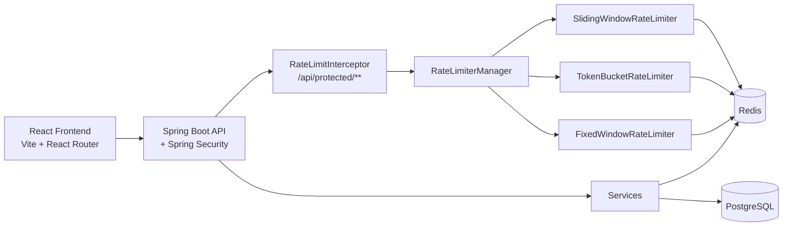
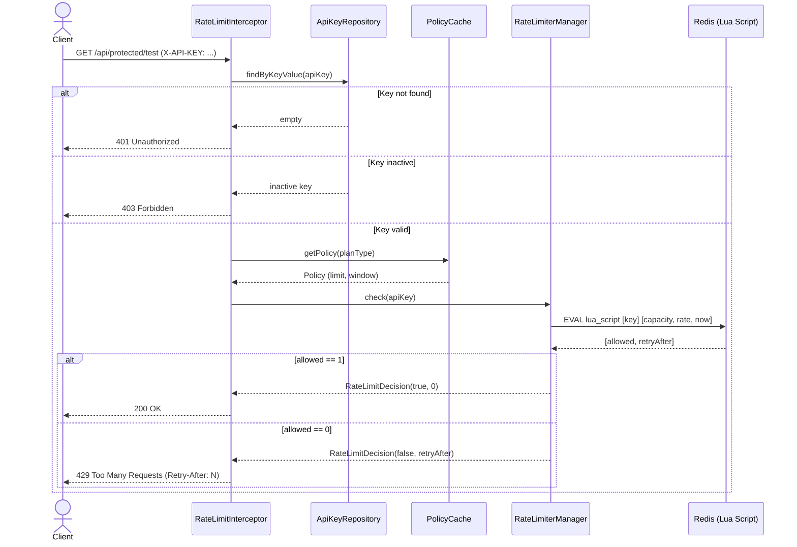
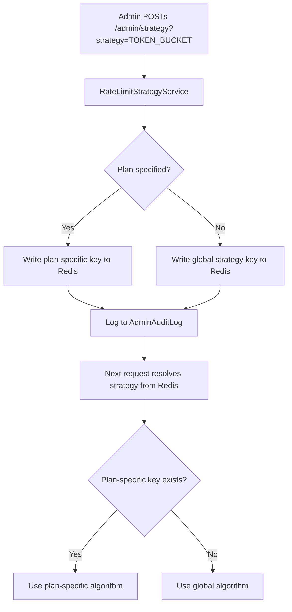
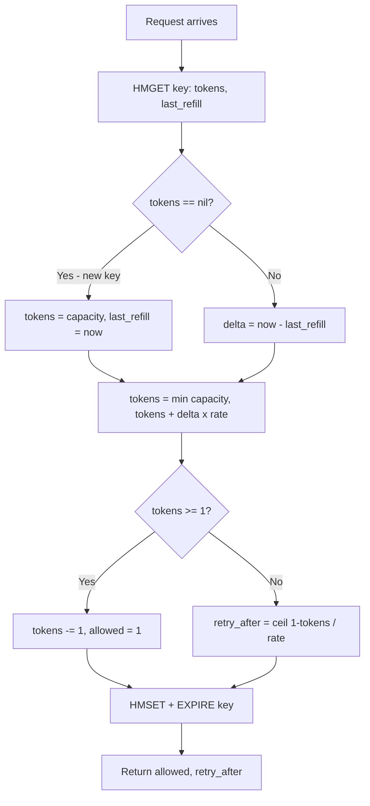
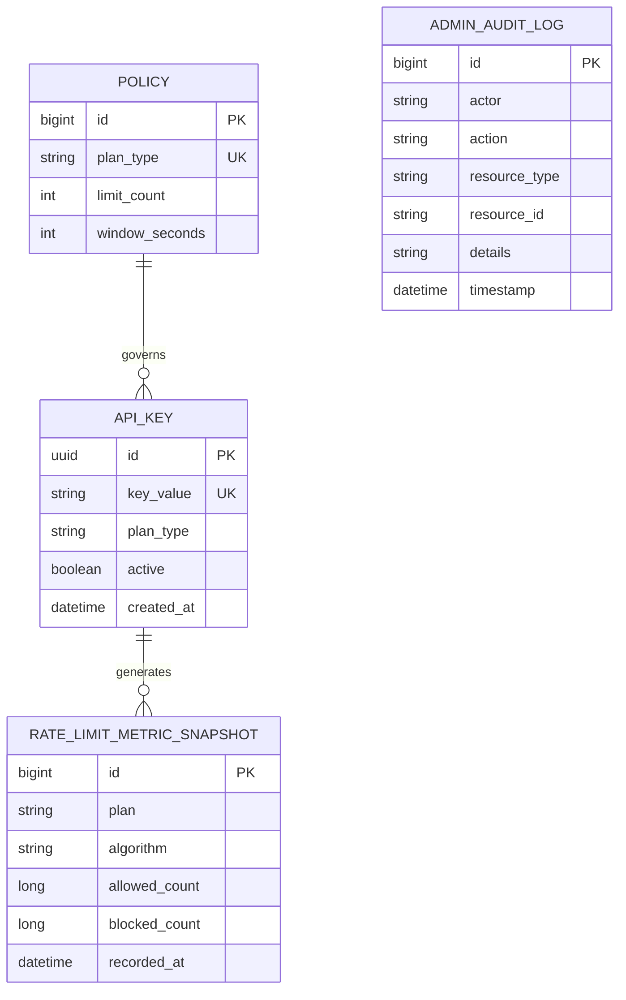

# Polaris

[](https://adoptium.net/)
[](https://spring.io/projects/spring-boot)
[](https://react.dev/)
[](https://redis.io/)
[](#testing)

A production-style API rate limiting control plane focused on algorithmic correctness, runtime configurability, and operational visibility.

The project demonstrates distributed rate limiting with:
- multiple enforcement algorithms switchable at runtime (per plan or globally)
- atomic Redis Lua scripts for correctness under concurrent load
- API key governance with plan-based policies
- role-based access for admin and user surfaces
- real-time metrics and audit logging

## Why This Project Exists

Most rate limiting demos hard-code a single algorithm with a fixed threshold. This one focuses on **operational correctness and runtime control**:
- What happens when multiple requests arrive simultaneously for the same key?
- How do you switch enforcement algorithms without restarting the service?
- How do you make rate limit decisions accurate under concurrent load?
- How do operators observe and control what the system is doing in real time?

The implementation treats these questions as first-class design concerns.

## Quick Navigation

- [Live Demo](#live-demo)
- [Engineering Invariants](#engineering-invariants)
- [Rate Limiting Algorithms](#rate-limiting-algorithms)
- [Plan Model](#plan-model)
- [System Architecture](#system-architecture)
- [Core Execution Flows](#core-execution-flows)
- [Data Model](#data-model)
- [Design Decisions and Rationale](#design-decisions-and-rationale)
- [Failure Modes and Handling](#failure-modes-and-handling)
- [Roles and Access](#roles-and-access)
- [API Summary](#api-summary)
- [Telemetry and Metrics](#telemetry-and-metrics)
- [Local Development](#local-development)
- [Environment Variables](#environment-variables)
- [Deployment (Railway)](#deployment-railway)
- [Testing](#testing)

## Live Demo

- **URL:** https://polaris-frontend-production.up.railway.app
- **Demo User (read-only):**
  - Username: `user`
  - Password: `User@123`

Admin credentials are intentionally private.

## Engineering Invariants

- **Atomic rate limit decisions**
  - All algorithm logic executes in a single Redis Lua script call — no race conditions between read and write.
- **Pluggable algorithm per plan**
  - Sliding window, token bucket, or fixed window can be set globally or per plan at runtime without restart.
- **API key lifecycle control**
  - Keys can be deactivated instantly; inactive keys are rejected before the rate limit check runs.
- **Policy-driven limits**
  - Each plan (FREE, PRO) has an explicit limit and window stored in the database and cached in memory.
- **Server-side authorization as source of truth**
  - RBAC is enforced on all backend endpoints regardless of UI behavior.
- **Auditable admin operations**
  - Every key creation, deactivation, and strategy change is written to a persistent audit log.

## Rate Limiting Algorithms

### Sliding Window (Default)

- Redis data structure: **sorted set (ZSET)** — members are timestamped request IDs
- Per request: remove expired entries, check count against limit, add new entry if allowed
- Retry-After: calculated as `(oldest_timestamp + window) - now`
- Gives a true rolling window — no boundary bursts
- Redis key: `rate_limit:sw:{apiKeyValue}`

### Token Bucket

- Redis data structure: **hash (HSET)** — fields: `tokens`, `last_refill`
- Refill rate: `capacity / windowSeconds` tokens per second
- Per request: compute tokens earned since last refill, cap at capacity, deduct 1 if available
- Retry-After: calculated as `ceil((1 - tokens) / refill_rate)`
- Allows controlled bursting up to bucket capacity
- Redis key: `rate_limit:tb:{apiKeyValue}`

### Fixed Window

- Redis data structure: **string counter** — keyed by `(now / window) * window`
- Per request: increment counter, reject if count exceeds limit
- Simple and low overhead; susceptible to boundary bursts at window edges
- Redis key: `rate_limit:{apiKeyValue}:{windowStart}`

All algorithms are implemented as atomic Lua scripts executed on Redis to prevent partial-read race conditions under concurrent load.

## Plan Model

| Plan | Requests | Window |
|------|----------|--------|
| `FREE` | 100 | 60 seconds |
| `PRO` | 1000 | 60 seconds |

Plans are stored as `Policy` entities in PostgreSQL and cached in memory via `PolicyCache`. The rate limit check reads from the cache — no DB hit per request.

## Tech Stack

**Backend**
- Java 21
- Spring Boot 4.0.3
- Spring Data JPA (Hibernate)
- Spring Data Redis (Lettuce)
- Spring Security
- Spring Boot Actuator (Micrometer)
- PostgreSQL
- Redis
- Maven

**Frontend**
- React 18.3
- React Router DOM 7.5
- Vite 5.0

## System Architecture



**Request path for `/api/protected/test` (rate-limited endpoint):**

1. `RateLimitInterceptor` extracts `X-API-KEY` header
2. Looks up `ApiKey` in DB → validates active status
3. Resolves plan → fetches `Policy` from `PolicyCache`
4. Resolves active algorithm from `RateLimiterManager` (reads strategy key from Redis)
5. Executes Lua script on Redis → decision + retry-after
6. Allowed: continues to controller → 200. Rejected: returns 429 + `Retry-After` header.

## Core Execution Flows

### Rate Limit Check Sequence



### Strategy Switch Flow



### Token Bucket Algorithm (Lua)



## Data Model



## Design Decisions and Rationale

| Decision | Why it was chosen | What it prevents |
|---|---|---|
| Atomic Lua scripts for all rate limit logic | Read-modify-write sequences in Redis are unsafe without atomicity; Lua executes as a single Redis command | Race conditions where two concurrent requests both read "1 token left" and both get allowed |
| Redis sorted set for sliding window | ZSET allows range removal by score (timestamp), enabling a true rolling window without cron cleanup | Boundary burst artifacts common in fixed-window approaches |
| Strategy stored in Redis (not DB or memory) | Allows runtime algorithm switching that takes effect on the next request | Stale strategy state after a hot config change |
| Policy cache in memory (ConcurrentHashMap) | Policy limits are read on every rate-limited request; DB query per request would introduce unnecessary latency | Per-request DB overhead at scale |
| Bearer tokens stored in memory (ConcurrentHashMap) | Simple stateless session model; tokens are revocable on logout with 12h TTL | Persistent session leaks from long-lived tokens |
| API key in `X-API-KEY` header (not Bearer) | Separates user session auth from API consumer auth | Token confusion between admin sessions and API key consumers |
| Backend-enforced RBAC (UI is secondary) | Security policy must hold even if frontend is bypassed | Privilege escalation through client-side manipulation |

## Failure Modes and Handling

| Failure Mode | Expected Behavior | Why this is acceptable |
|---|---|---|
| Redis unreachable during rate limit check | `SlidingWindowRateLimiter` catches the exception and returns `allowed=true` (fail-open) | Prevents a Redis outage from cascading into full API unavailability |
| Invalid or missing `X-API-KEY` header | Interceptor returns 401 before rate limit logic runs | Separates auth failure from rate limit failure |
| Inactive API key presented | Interceptor returns 403 before rate limit logic runs | Deactivated keys are rejected immediately regardless of quota state |
| Rate limit exceeded | Returns 429 with `Retry-After: N` header | Client has a precise signal for when to retry |
| Bearer token expired or revoked | `BearerTokenAuthenticationFilter` returns 401 | All session state is cleared on logout |
| Unauthorized write from USER role | Backend returns 403 | Security does not depend on frontend controls |

## Roles and Access

**ADMIN**
- Create, list, view, and deactivate API keys
- Switch rate limiting strategy (global or per plan)
- View metrics summary and audit logs
- Access all actuator endpoints

**USER**
- Verify API keys and view plan info
- Run request simulation against the rate-limited endpoint
- View own user profile

### Auth Flow

- Login via `POST /auth/login` with `{ username, password, role }`
- Returns a 64-character bearer token (in-memory, TTL 12 hours)
- All protected requests require `Authorization: Bearer <token>` header
- Logout via `POST /auth/logout` revokes the token immediately

## API Summary

### Auth
- `POST /auth/login` — login, returns bearer token
- `GET /auth/me` — current authenticated user
- `POST /auth/logout` — revoke token

### API Keys (ADMIN)
- `POST /api/keys?plan={FREE|PRO}` — create new API key
- `GET /api/keys` — list all keys
- `GET /api/keys/{id}` — get key by UUID
- `DELETE /api/keys/{id}` — deactivate key

### Rate-Limited Endpoint
- `GET /api/protected/test` — test endpoint enforcing rate limits (requires `X-API-KEY` header)

### Profiles
- `GET /profiles/admin` — admin strategy overview (ADMIN)
- `GET /profiles/user` — user plan and strategy info (USER + ADMIN, requires `X-API-KEY` header)

### Strategy (ADMIN)
- `GET /admin/strategy` — current global strategy
- `POST /admin/strategy?strategy={SLIDING_WINDOW|TOKEN_BUCKET|FIXED_WINDOW}&plan={FREE|PRO}` — switch algorithm (omit `plan` for global)
- `GET /admin/strategy/debug` — strategy debug info

### Metrics (ADMIN)
- `GET /admin/metrics/summary` — persisted rate limit metric snapshots

### Audit (ADMIN)
- `GET /admin/audit/logs?limit={n}` — admin audit log (max 200, default 50)

### Health (public)
- `GET /actuator/health` — system health with DB and Redis component details
- `GET /actuator/metrics/rate_limit.{allowed|blocked}` — Micrometer counters (ADMIN)

## Telemetry and Metrics

Micrometer counters are tracked per request and tagged by plan and algorithm:

- `rate_limit.allowed` — requests that passed the rate limit check
- `rate_limit.blocked` — requests that were rejected (429)

Tags: `plan` (FREE, PRO), `algorithm` (sliding_window, token_bucket, fixed_window)

Snapshots are persisted to PostgreSQL via `PersistentMetricsService` and accessible at:
- `GET /admin/metrics/summary`
- `GET /actuator/metrics/rate_limit.allowed?tag=plan:FREE&tag=algorithm:sliding_window`

Audit logs track all admin operations (key creation, deactivation, strategy changes) with actor, resource type, and timestamp — accessible at `GET /admin/audit/logs`.

## Local Development

### 1. Clone

```bash
git clone https://github.com/Kailas2004/polaris-api-monitoring.git
cd polaris-api-monitoring
```

### 2. Start Dependencies

```bash
docker compose up -d
```

This starts PostgreSQL 15 on port `5434` and Redis 7 on port `6379`.

### 3. Run Backend

```bash
./mvnw spring-boot:run
```

Backend starts at `http://localhost:8080`.

Default credentials: `admin / Admin@123` and `user / User@123`.

### 4. Run Frontend

```bash
cd frontend
npm install
npm run dev
```

Frontend starts at `http://localhost:5173`.

Visit `http://localhost:5173`, log in as admin, create an API key, then paste it into the user simulator to test rate limiting.

## Environment Variables

### Database

| Variable | Purpose |
|---|---|
| `SPRING_DATASOURCE_URL` | PostgreSQL JDBC URL |
| `SPRING_DATASOURCE_USERNAME` | DB username |
| `SPRING_DATASOURCE_PASSWORD` | DB password |

### Redis

| Variable | Purpose |
|---|---|
| `SPRING_DATA_REDIS_URL` | Full Redis URI — takes precedence over host/port |
| `SPRING_DATA_REDIS_HOST` | Redis hostname |
| `SPRING_DATA_REDIS_PORT` | Redis port |
| `SPRING_DATA_REDIS_USERNAME` | Redis username (optional) |
| `SPRING_DATA_REDIS_PASSWORD` | Redis password (optional) |

### Authentication

| Variable | Default | Purpose |
|---|---|---|
| `POLARIS_AUTH_ADMIN_USERNAME` | `admin` | Admin username |
| `POLARIS_AUTH_ADMIN_PASSWORD` | `Admin@123` | Admin password |
| `POLARIS_AUTH_USER_USERNAME` | `user` | User username |
| `POLARIS_AUTH_USER_PASSWORD` | `User@123` | User password |
| `POLARIS_AUTH_TOKEN_TTL_SECONDS` | `43200` | Bearer token TTL (12 hours) |

### CORS

| Variable | Default | Purpose |
|---|---|---|
| `POLARIS_CORS_ALLOWED_ORIGINS` | localhost origins | Explicit allowed origins (comma-separated) |
| `POLARIS_CORS_ALLOWED_ORIGIN_PATTERNS` | `https://*.up.railway.app` | Wildcard origin patterns |

### Rate Limiting

| Variable | Default | Purpose |
|---|---|---|
| `RATE_LIMITER_TYPE` | `sliding` | Default algorithm on startup (`sliding`, `token`, `fixed`) |

### Server

| Variable | Default | Purpose |
|---|---|---|
| `PORT` | `8080` | Server port (set automatically by Railway) |

### Frontend (build-time)

| Variable | Purpose |
|---|---|
| `VITE_API_BASE_URL` | Backend URL baked into the frontend bundle at build time |

## Deployment (Railway)

This project auto-deploys on Railway from the connected GitHub repository.

**Services:**
- `polaris-api` — Spring Boot backend (root `Dockerfile`)
- `polaris-frontend` — React frontend (`frontend/Dockerfile`)
- `Redis` — managed Redis service
- `Postgres` — managed PostgreSQL service

Push to the `main` branch and Railway rebuilds and deploys all services automatically.

The `frontend/Dockerfile` builds from the repository root as the Docker build context — all `COPY` paths are prefixed with `frontend/` to account for this.

The backend `Dockerfile` uses a multi-stage Maven build on `eclipse-temurin:21` and runs the JVM with `-Djava.net.preferIPv6Addresses=true` for Railway's IPv6 private networking.

## Testing

### Backend Tests

```bash
./mvnw test
```

Tests use **Testcontainers** (PostgreSQL 15 + Redis 7) — no local infrastructure needed for integration tests.

### Test Coverage

`RateLimiterIntegrationTest` validates FREE plan enforcement end-to-end:
- Creates a FREE plan API key (100 requests / 60 seconds)
- Sends 105 sequential requests to the rate-limited endpoint
- Asserts exactly 100 allowed (HTTP 200) and 5 blocked (HTTP 429)

`PolarisApplicationTests` validates the Spring context loads cleanly with all beans wired.